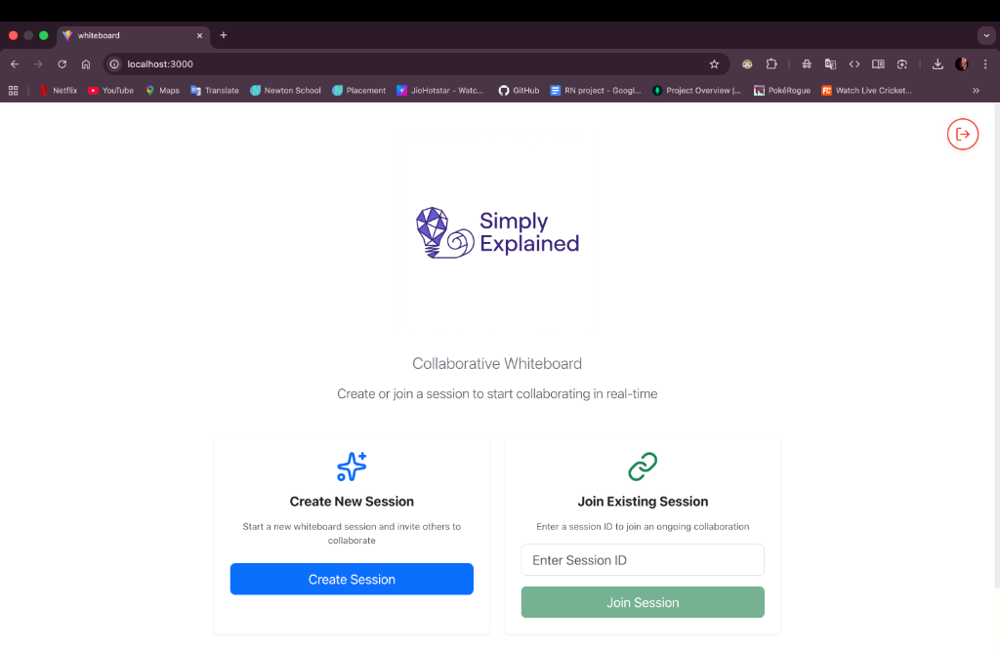
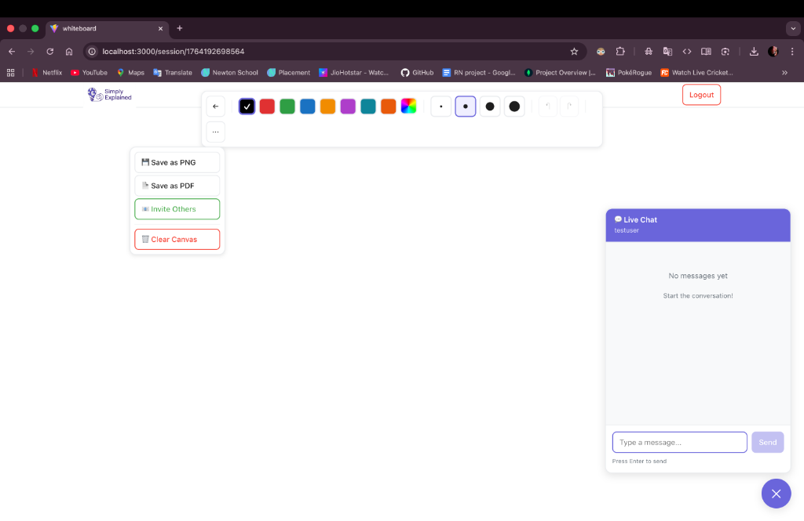

# Simply Explained - Collaborative Whiteboard Setup Guide

This guide will help you set up and run the Simply Explained collaborative whiteboard application, which consists of a React frontend, Node.js backend, and Keycloak authentication.

## Screenshots

### Home Page


### Whiteboard Session


## Project Structure

```
simply-explained/
├── backend/           
│   ├── src/
│   ├── package.json
│   └── .env.example
├── whiteboard/       
│   ├── src/
│   ├── package.json
│   └── vite.config.ts
├── keycloak/
│   └── realm-export.json
└── docker-compose.yml      
```

---

## Quick Start (Docker)

If you want to get everything running quickly:

### 1. Start Keycloak and PostgreSQL
```bash
docker-compose up -d
```

This will start:
- **PostgreSQL** on port `5432`
- **Keycloak** on port `8080`

Wait for services to be healthy (about 30-60 seconds):
```bash
docker-compose ps
```

### 2. Import Keycloak Realm
```bash
open http://localhost:8080
```

- Login with credentials: `admin` / `admin`
- Import the realm: **Create realm** → **Browse** → Select `keycloak/realm-export.json` → **Create**

### 3. Install and Run Backend
```bash
cd backend
npm install
cp .env.example .env
npm run dev
```

Backend will start on `http://localhost:3000`

### 4. Install and Run Frontend
```bash
cd whiteboard
npm install
npm run dev
```

Frontend will start on `http://localhost:5173`

### 5. Access the Application
Open your browser and navigate to:
```
http://localhost:5173
```

**Test Credentials:**
- Username: `testuser`
- Password: `password`

---

## Manual Setup

### 1. Keycloak Setup

#### Start Keycloak with Docker
```bash
docker-compose up -d postgres keycloak
```

#### Configure Keycloak

1. **Access Admin Console:**
   ```
   http://localhost:8080
   ```
   Login: `admin` / `admin`

2. **Import Realm:**
   - Click **Create realm** (top-left dropdown)
   - Click **Browse** and select `keycloak/realm-export.json`
   - Click **Create**

3. **Verify Realm Configuration:**
   - Realm name: `simply-explained`
   - Client ID: `whiteboard`
   - Test user: `testuser` (password: `password`)

4. **Update Redirect URIs (if needed):**
   - Go to **Clients** → **whiteboard**
   - Update **Valid redirect URIs** to match your frontend URL:
     ```
     http://localhost:5173/*
     ```
   - Update **Web origins**:
     ```
     http://localhost:5173
     ```
   - Click **Save**

---

### 2. Backend Setup

#### Install Dependencies
```bash
cd backend
npm install
```

#### Configure Environment Variables
```bash
cp .env.example .env
```

Edit `.env` file:
```env
# Email Configuration (for invitation feature)
SMTP_HOST=smtp.gmail.com
SMTP_PORT=587
SMTP_USER=your-email@gmail.com
SMTP_PASS=your-app-specific-password

# Frontend URL
FRONTEND_URL=http://localhost:5173
```

#### Available Scripts

- **Development mode** (with hot reload):
  ```bash
  npm run dev
  ```

#### Backend Configuration

The backend runs on **port 3000** by default. Key features:
- **WebSocket server** (Socket.io) for real-time collaboration
- **REST API** for session management and invitations
- **CORS** enabled for frontend communication

---

### 3. Frontend Setup

#### Install Dependencies
```bash
cd whiteboard
npm install
```

#### Configure Keycloak Connection

The Keycloak configuration is in `whiteboard/src/keycloak.ts`. Default settings:
```typescript
{
  url: 'http://localhost:8080',
  realm: 'dendrite',
  clientId: 'whiteboard'
}
```

If you need to change these, update the file accordingly.

#### Available Scripts

- **Development mode** (with hot reload):
  ```bash
  npm run dev
  ```

#### Frontend Configuration

The frontend runs on **port 5173** by default (Vite dev server). Key features:
- **React 18** with TypeScript
- **Vite** for fast development and building
- **React Router** for navigation
- **Konva/React-Konva** for canvas drawing
- **Socket.io Client** for real-time collaboration
- **Keycloak JS** for authentication

---

## Running the Application

1. **Terminal 1 - Start Docker services:**
   ```bash
   docker-compose up -d
   ```

2. **Terminal 2 - Start Backend:**
   ```bash
   cd backend
   npm run dev
   ```

3. **Terminal 3 - Start Frontend:**
   ```bash
   cd whiteboard
   npm run dev
   ```

## Testing the Application

### 1. Login
- Navigate to `http://localhost:5173`
- Login with: `testuser` / `password`

### 2. Create a Session
- Click **"Create New Session"** on the home page
- You'll be redirected to the whiteboard

### 3. Test Drawing
- Use the toolbar to select different tools (pen, eraser, shapes)
- Draw on the canvas
- Change colors and stroke widths

### 4. Test Collaboration
- Copy the session ID from the toolbar
- Open a new browser window (or incognito mode)
- Login as the same or different user
- Click **"Join Session"** and paste the session ID
- Both windows should see real-time updates

### 5. Test Chat
- Use the chat panel on the right side
- Send messages between users in the same session

### 6. Test Invitations (if email configured)
- Click the **"Invite"** button in the toolbar
- Enter an email address
- The recipient will receive an email with a join link

---

